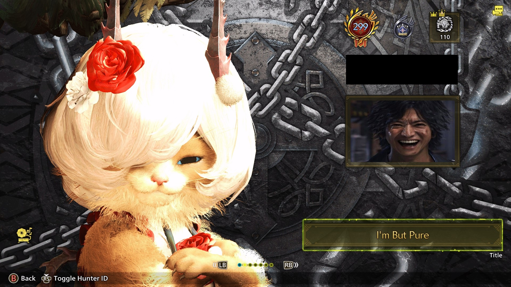
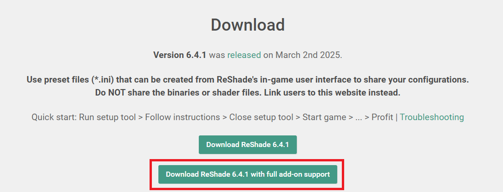
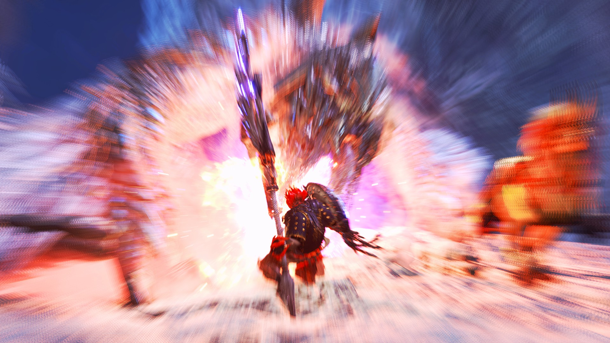
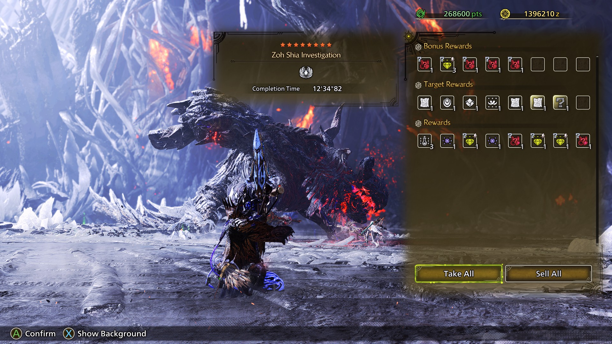
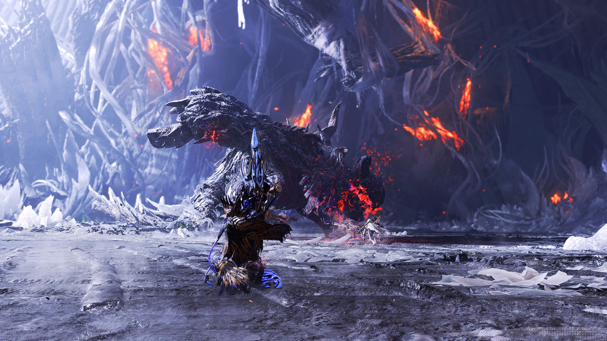

# MHWilds High Quality Photo

## Features

- **Allow using WebP image stored on your computer to overwrite quest result background image or photo mode image:** These override photo mode images can be upload to your hunter profile (please respect the TOS, don't post corn)
- **Allow high quality quest result background, with ReShade applied**: Requires ReShade with Add-on. The background will already have ReShade applied and can be screenshoted directly using Steam F12

## Requirements

### Must

- **REFramework:** version after [3f9086](https://github.com/praydog/REFramework-nightly/releases/tag/nightly-01165-3f9086ffa7a1d063206f497b0fd56fbb29eacd2a). Click the number jambo to download the compatible REFramework
- **ReShade with Add-On from version 6.x** (the one in the red box below)
    * This is for high-quality image capture
    * If you only install normal ReShade, the override image options are still available, but the high-quality capture will do nothing

### Optionals

- **[SlowMo Mod](https://www.nexusmods.com/monsterhunterwilds/mods/864):** really recommend you to install it. The mod may have some problems capture the quest result output if this mod is not present, but I have tried handle those problems

## Warnings

### HIGH QUALITY CAPTURE MODE: HDR: IS NOT OFFICIALLY SUPPORTED (YET)

- I don't have a HDR monitor, but I have tried to make the mod work with high quality capture
- Override image only users: you are good

## Installations

1. Install **REFramework:** version after [3f9086](https://github.com/praydog/REFramework-nightly/releases/tag/nightly-01165-3f9086ffa7a1d063206f497b0fd56fbb29eacd2a)

2. Install **ReShade WITH [ADD-ON](https://reshade.me/downloads/ReShade_Setup_6.4.1_Addon.exe)**: download this version, notices the caps lock

3. Download and extract this mod in the same folder as your MonsterHunterWilds.exe

    MonsterHunterWilds

    ├── dinput8.dll

    ├── MonsterHunterWilds.exe

    ├── reframework

    │   ├── plugins

    │   │   ├── MHWildsHighQualityPhoto.dll

    |── MHWildsHighQualityPhoto_Reshade.addon

    |── hdrfix.exe

## Credits
- [praydog](https://github.com/praydog/REFramework) for REFramework
- [ReShade](https://github.com/crosire/reshade) team
- AVIR image resizing algorithm designed by [Aleksey Vaneev](https://github.com/avaneev)
- All other dependencies authors: cimgui, glaze, hdrfix, imgui, nfd-extended, stb, subprocess.h, threadpool, libwebp

## Preview

- NOTE: I'm using:
    * [Disable Post-Processing Effects](https://www.nexusmods.com/monsterhunterwilds/mods/221)
    * [Tweak In Game Volumetric Fogs](https://www.nexusmods.com/monsterhunterwilds/mods/455)
    * [Monster Hunter Wilds ReGraded](https://www.nexusmods.com/monsterhunterwilds/mods/594)
    * [End Slow-Mo](https://www.nexusmods.com/monsterhunterwilds/mods/864)

### Photo-mode (captured with Steam F12), differences can be visible when you compare them in fullscreen

### Quest result (lossless, very crisp)

# MOD Q&A

## What is the game doing

- The game uses WebP to store quest result background and album photo mode image
- The two discoveries below are from my own testing. Your feedback may change this Q&A

### For album image:
- The game forces your album image to be a WebP, file size <= 256KB
- The game force your image resolution to be of 1920x1080
- Because of these two facts, your album image is always compressed to the brim. The final WebP stored to your save data is usually 30-50% of original quality

### For quest result image
- The quest result image is 1920x1080 on 16x9 mode and 2560x1080 on 21x9 mode. File size <= 256KB. The final WebP stored to your save data is usually 30-50% of original quality

## What I have done

- **You can override your photo mode result, quest result background with your own image**: For now, try to keep the file size <= 256KB and image resolution of 1920x1080. For quest result image, be wary of the resolution (1920x1080 on 16x9 mode and 2560x1080 on 21x9 mode)

- **Quest result background/hunter highlights background:**
    - Image is lossless now. But your result background need to scale to fit the requirements. On 4K screen, you are basically being scaled down to 1080p
    - Image will preserve all the ReShade details applied to it:
        + The mod will hide the game UI for few frames, do a ReShade screenshot and then inject the screenshot into the game.
        + When the quest result screen is displayed, ReShade effects are turned off, so that the captured screenshot may display in correct colors.

## Why the fixed 1920x1080 or 2560x1080 size?

- Your image will be store in a texture object to show to the screen. If the image and the texture object's dimension does not match, the game will either show a corrupt cat icon, or use a backup image to show to the screen (I have not digged deep into the backup part yet)
- The information of that texture is being stored in an asset file. There are two textures in fact, one for 16:9 and one for 21:9
- These two asset files are (used in GameSystem.scn):
  * GUI/ui_texture/tex_render/rtt990000_00.rtex.6 (offset 0x10 and 0x14 is width and height, 16:9)
  * GUI/ui_texture/tex_render/rtt990000_10.rtex.6 (offset 0x10 and 0x14 is width and height, 21:9)
- Can I overwrite these tex to allow more high resolution? I think so, but I will only try if there's demand really (I'm not familiar with asset modding yet)
